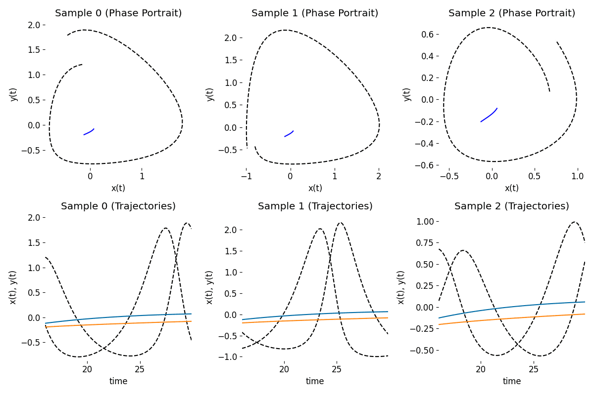

# PyTorch Implementation of Differentiable Laplace Reconstructions

[](https://samholt.github.io/NeuralLaplace/)
[](https://github.com/samholt/NeuralLaplace/actions/workflows/test.yml)
[](https://arxiv.org/abs/2206.04843)
[](https://opensource.org/licenses/MIT)


This library provides Inverse Laplace Transform (ILT) algorithms implemented in PyTorch. Backpropagation through differential equation (DE) solutions in the Laplace domain is supported using the Riemann stereographic projection for better global representation of the complex Laplace domain. For usage for DE representations in the Laplace domain in deep learning applications, see reference [[1]](https://arxiv.org/abs/2206.04843).

## Installation

To install latest stable version:

```
pip install torchlaplace
```

To install the latest on GitHub:

```
pip install git+https://github.com/samholt/torchlaplace
```

## Tutorials
1. Tutorial: Laplace Reconstruct [](https://colab.research.google.com/drive/1JCakl2DFzHnBh_C6YXBpnGYKUmBVPN3Y?usp=sharing)
2. Tutorial: Inverse Laplace Transform Algorithms [](https://colab.research.google.com/drive/1ZNAA9CdXbA8B-Vp3r5Zqx3mM4CojtI6V?usp=sharing)
## Examples

Examples are placed in the [`examples`](./examples) directory.

We encourage those who are interested in using this library to take a look at [`examples/simple_demo.py`](./examples/simple_demo.py) for understanding how to use `torchlaplace` to fit a DE system.

<p align="center">

</p>

## Basic usage

This library provides one main interface `laplace_reconstruct` which uses a selected inverse Laplace transform algorithm to reconstruct trajectories from a provided parameterized Laplace representation functional $\mathbf{F}(\mathbf{p},\mathbf{s})$,

$$\mathbf{x}(t) = \text{inverse laplace transform}(\mathbf{F}(\mathbf{p},\mathbf{s}), t)$$

Where $\mathbf{p}$ is a Tensor encoding the initial system state as a latent variable, and $t$ is the time points to reconstruct trajectories for.

This can be used by

```
from torchlaplace import laplace_reconstruct

laplace_reconstruct(laplace_rep_func, p, t)
```

where `laplace_rep_func` is any callable implementing the parameterized Laplace representation functional $\mathbf{F}(\mathbf{p},\mathbf{s})$, `p` is a Tensor encoding the initial state of shape $(\text{MiniBatchSize},\text{K})$.
Where $\text{K}$ is a hyperparameter, and can be set by the user.
Finally, `t` is a Tensor of shape $(\text{MiniBatchSize},\text{SeqLen})$
or $(\text{SeqLen})$ containing the time points to reconstruct the trajectories for.

Note that this is not numerically stable for all ILT methods, however should probably be fine with the default `fourier` (fourier series inverse) ILT algorithm.

The parameterized Laplace representation functional `laplace_rep_func`, $\mathbf{F}(\mathbf{p},\mathbf{s})$
also takes an input complex value $\mathbf{s}$.
This $\mathbf{s}$ is used internally when reconstructing a specified time point with the selected inverse Laplace transform algorithm `ilt_algorithm`.

The biggest **gotcha** is that `laplace_rep_func` must be a `nn.Module` when using the `laplace_rep_func` function. This is due to internally needing to collect the parameters of the parameterized Laplace representation.

To replicate the experiments in [1] see the in the [`experiments`](./experiments) directory.

### Keyword arguments for `laplace_rep_func`

#### Keyword arguments:

- `recon_dim` (int): trajectory dimension for a given time point. Corresponds to dim $d_{\text{obs}}$. If not explicitly specified, will use the same last dimension of `p`, i.e. $\text{K}$.
- `ilt_algorithm` (str): inverse Laplace transform algorithm to use. Default: `fourier`. Available are {`fourier`, `dehoog`, `cme`, `fixed_tablot`, `stehfest`}. See api documentation on ILTs for further details.
- `use_sphere_projection` (bool): this uses the `laplace_rep_func` in the stereographic projection of the Riemann sphere. Default `True`.
- `ilt_reconstruction_terms` (int): number of ILT reconstruction terms, i.e. the number of complex $s$ points in `laplace_rep_func` to reconstruct a single time point.

#### List of ILT Algorithms:

ILT algorithms implemented:

- `fourier` Fourier Series Inverse **[default]**.
- `dehoog` DeHoog (Accelerated version of Fourier) - Slower inference in comparison.
- `cme` Concentrated Matrix Exponentials.
- `fixed_tablot` Fixed Tablot.
- `stehfest` Gaver-Stehfest.

For most problems, good choices are the default `fourier`. However other ILT algorithms may be more appropriate when using higher ILT reconstruction terms, such as the `cme` algorithm. Some allow trade-offs between speed and accuracy, for example `dehoog` is very accurate if the representation is known or exact, however is slow and can be unstable to use when learning the correct representation.

## Detailed documentation

For detailed documentation see the [official docs](https://samholt.github.io/NeuralLaplace/).

## Frequently Asked Questions

Take a look at our [FAQ](FAQ.md) for frequently asked questions.

## References

For usage for DE representations in the Laplace domain and leveraging the stereographic projection and other applications see:

[1] Samuel Holt, Zhaozhi Qian, and Mihaela van der Schaar. "Neural laplace: Learning diverse classes of
differential equations in the laplace domain." _International Conference on Machine Learning._ 2022. [[arxiv]](https://arxiv.org/abs/2206.04843)

---

If you found this library useful in your research, please consider citing.

```
@inproceedings{holt2022neural,
  title={Neural Laplace: Learning diverse classes of differential equations in the Laplace domain},
  author={Holt, Samuel I and Qian, Zhaozhi and van der Schaar, Mihaela},
  booktitle={International Conference on Machine Learning},
  pages={8811--8832},
  year={2022},
  organization={PMLR}
}

```
