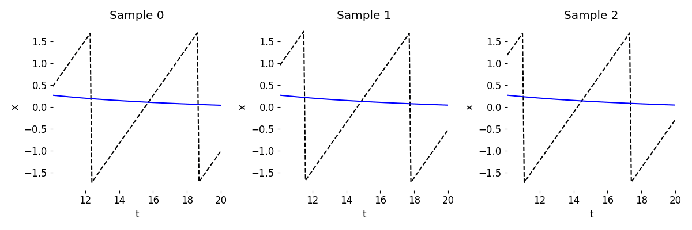

# Overview of Examples

This `examples` directory contains clean code examples of the usage of DE representations in the Laplace domain in machine learning. The scripts in this directory assume that `torchlaplace` is installed following instructions from the main directory.

## Demo

The [`simple_demo.py`](./simple_demo.py) file contains a short implementation of learning a DE representation to extrapolate a sawtooth waveform. The first half of the trajectory (with a random phase component) is observed (encoded and fed into the Laplace representation) to predice the later half of the trajectory correctly.

To visualize the training progress, run

```
python simple_demo.py --viz
```

The training should look similar to this:

<p align="center">

</p>

## Delay Differential Equation Demo

The [`dde_demo.py`](./dde_demo.py) file contains similarly a short implementation of learning a DE representation to extrapolate, however for a delay differential equation system, that of a Lotka Volterra system with delay [[1]](https://arxiv.org/abs/2206.04843). Note sampling a DDE is a slow process, therefore the dataset function uses memoization to keep the sampled trajectories for next run time, if applicable. For example sampling 1,000 DDE trajectories to form a dataset to use for training, validation and testing can take approx. 15 minutes.

To visualize the training progress, run

```
python dde_demo.py --viz
```

The training should look similar to this:

<p align="center">

</p>

## Demo with double precision

The [`simple_demo_double_precision.py`](./simple_demo_double_precision.py) file contains the same implementation as in `simple_demo.py`, however implementing and showing how to incorporate double floating point precision. It is understood that inverse Laplace transform algorithms perform better with higher precision, and hence we expect better Laplace representations when using higher precision. However using a higher precision throughout can lead to doubling of data sizes and accordingly slow down processing compared to single floating point precision. Here we mean double floating point precision to use `torch.float64`, compared to single floating point precision of `torch.float32`.

## Inverse Laplace transform algorithms

The [`ilt_demo.py`](./ilt_demo.py) file contains the implemented inverse Laplace transform algorithms comparing them against reconstructing a sine wave, measuring the mean squared error of the reconstruction and the time taken to compare them amongst each other. These assume a known $F(\mathbf{s})$, i.e. Laplace representation to use to reconstruct time points t for. In `torchlaplace` we use these inverse Laplace transform algorithms backpropagating through them to update a neural network representing $F(\mathbf{s})$. For more details on inverse Laplace transform algorithms see [[1]](https://arxiv.org/abs/2206.04843).

## Experiments from Neural Laplace paper

See the [`experiments`](../experiments) directory to replicate the experiments from the [Neural Laplace paper](https://arxiv.org/abs/2206.04843).
